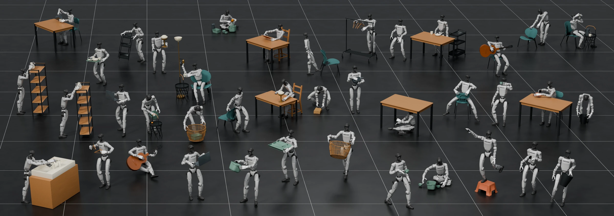

<p align="center">
  
</p>

<h1 align="center">DexWeave: Learning Dexterous Humanoid Loco-Manipulation from Human Demonstrations</h1>

<p align="center">
  <a href="https://naichuan04.github.io/">Naichuan Sun</a><sup>1,2,*</sup>,
  <a href="https://github.com/Tesla-SHT/">Haotian Shen</a><sup>1,*</sup>,
  Yizhang Zhang<sup>1</sup>,
  <a href="https://fengluying.github.io/">Luying Feng</a><sup>1</sup>,
  Haoze Wang<sup>1</sup>,<br>
  <a href="https://kam1107.github.io/">Yuanbo Xiangli</a><sup>2</sup>,
  <a href="https://en.westlake.edu.cn/faculty/yaochu-jin.html">Yaochu Jin</a><sup>1</sup>,
  <a href="https://ethliup.github.io/">Peidong Liu</a><sup>1,†</sup>
</p>

<p align="center">
  <sup>1</sup>Department of Artificial Intelligence, School of Engineering, Westlake University<br>
  <sup>2</sup>School of Artificial Intelligence, Shanghai Jiao Tong University<br>
  <sup>*</sup>Equal contribution &nbsp; <sup>†</sup>Corresponding author
</p>

<p align="center">
  <a href="https://dexweave.github.io/"></a>
  <a href="https://arxiv.org/abs/2609.34724"></a>
  <a href="https://www.youtube.com/watch?v=Rr2A_dAr8AQ"></a>
</p>



**TL;DR:** DexWeave combines interaction-consistent motion retargeting with anatomy-aware reinforcement learning to enable dexterous humanoid loco-manipulation from human demonstrations.

## 🔥🔥🔥 News

- **2026-9-30**: We launched the [DexWeave project website](https://dexweave.github.io/).
- **2026-9-30**: Our paper is available on [arXiv](https://arxiv.org/abs/2609.34724). Code will be released soon.
- **2026-9-30**: We release this repo.


## ⚒️ TODO

* [ ] Release code
* [x] Release paper


## Citation

If you find this useful, please consider citing:

```bibtex
@article{sun2026dexweave,
  author    = {Sun, Naichuan and Shen, Haotian and Zhang, Yizhang and Feng, Luying and Wang, Haoze and Xiangli, Yuanbo and Jin, Yaochu and Liu, Peidong},
  title     = {DexWeave: Learning Dexterous Humanoid Loco-Manipulation from Human Demonstrations},
  journal   = {arXiv},
  year      = {2026},
}
```


## Acknowledgement

This project is based on [BeyondMimic](https://github.com/HybridRobotics/whole_body_tracking), [DeepMimic](https://github.com/xbpeng/DeepMimic), [OmniRetarget](https://github.com/amazon-far/holosoma) and [GMR](https://github.com/YanjieZe/GMR). Thanks for their awesome works.
